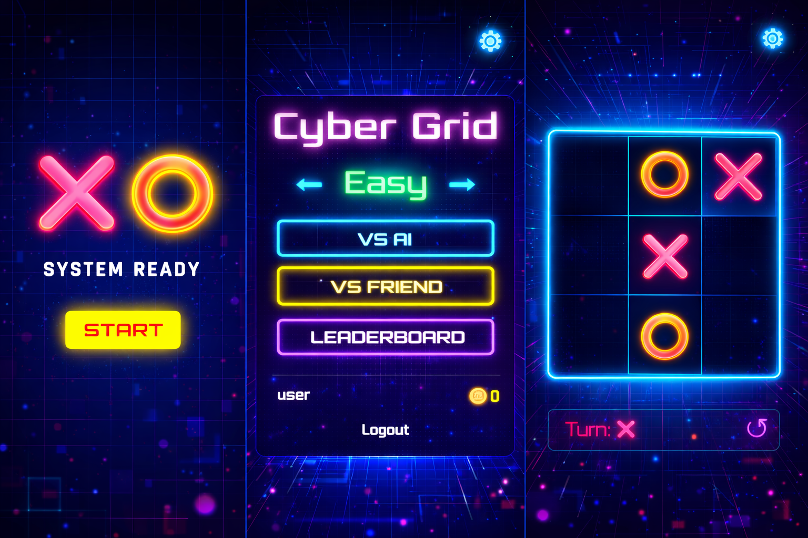

# 🕹️ Neon Tic-Tac-Toe: Cyber Grid

[](#)
[](#)

**Neon Tic-Tac-Toe: Cyber Grid** merupakan sebuah implementasi modern dari permainan strategi klasik noughts and crosses yang menggabungkan kecanggihan algoritma komputer dengan estetika visual Cyberpunk. Proyek ini dirancang untuk mendemonstrasikan kapabilitas pengembangan aplikasi web berbasis client-side murni dengan fokus pada optimasi pengalaman pengguna (User Experience) dan kecerdasan buatan.



---

## 👤 Identitas Developer

* **Nama Lengkap**: Michael Julio Sonda
* **Institusi**: Universitas Kristen Satya Wacana (UKSW)
* **Program Studi**: Teknik Informatika (Class of 2023)
* **Keahlian**: Web Design & Development, UI/UX Design

---

## 🚀 Fitur Unggulan

* **Tiga Tingkat Kesulitan AI**:
    * **Easy**: AI memilih langkah secara acak.
    * **Medium**: AI mulai bisa memblokir langkah kemenanganmu (Defensive).
    * **Hard**: Menggunakan **Algoritma Minimax**, membuat AI hampir tidak terkalahkan.
* **👥 Mode Local PvP**: Bermain bersama teman dalam satu perangkat.
* **🏆 Sistem Leaderboard**: Bersaing mendapatkan skor tertinggi dan naikkan peringkatmu.
* **🎨 Estetika Cyberpunk**: Antarmuka berbasis *Grid* dengan efek cahaya neon, animasi *flicker*, dan font futuristik (Orbitron & Rajdhani).
* **🔊 Audio Imersif**: Dilengkapi dengan *Background Music* (BGM) dan *Sound Effects* (SFX) yang dapat diatur di menu Settings.
* **🔄 Fitur Undo**: Salah melangkah? Gunakan fitur undo untuk kembali ke posisi sebelumnya.
* **💾 Auto-Save**: Data pemain dan pengaturan tersimpan secara otomatis menggunakan `localStorage`.

---

## 🛠️ Teknologi yang Digunakan

* **HTML5**: Struktur semantik untuk berbagai layar (Loading, Auth, Menu, Gameplay).
* **CSS3**: Animasi *keyframe*, efek *glassmorphism*, dan desain responsif menggunakan Flexbox.
* **JavaScript (Vanilla)**: 
    * **State Management**: Mengelola transisi layar dan data permainan.
    * **AI Minimax**: Implementasi rekursif untuk menentukan langkah optimal.
    * **DOM Manipulation**: Untuk rendering papan permainan secara dinamis.

---

## 📁 Struktur Folder

```text
Game Sonda/
├── index.html          # File utama (Entry Point)
├── style.css           # Styling & Animasi Neon
├── script.js           # Logik Permainan & AI
├── Neon_cyber_grid...  # Aset Gambar Preview
└── musik/              # Aset Audio
    ├── musik.mp3       # Background Music (BGM)
    ├── klik.ogg        # Efek suara klik tombol
    ├── menang.ogg      # Efek suara kemenangan
    ├── kalah.ogg       # Efek suara kekalahan
    └── start.ogg       # Efek suara mulai game
